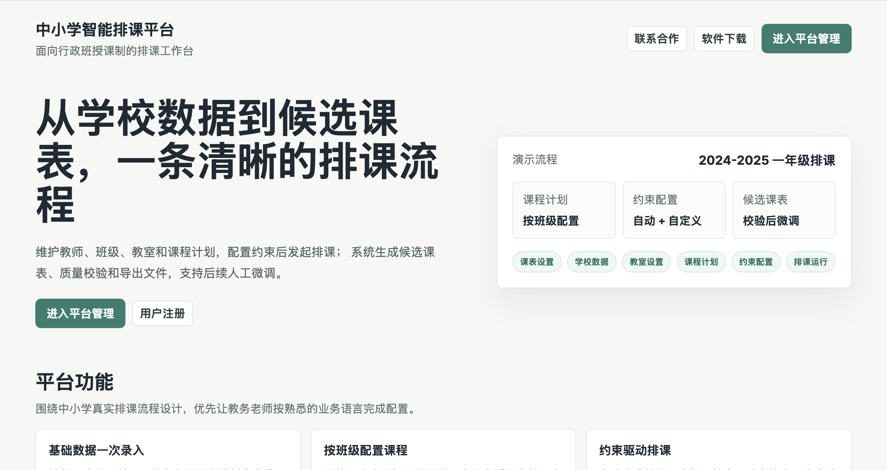
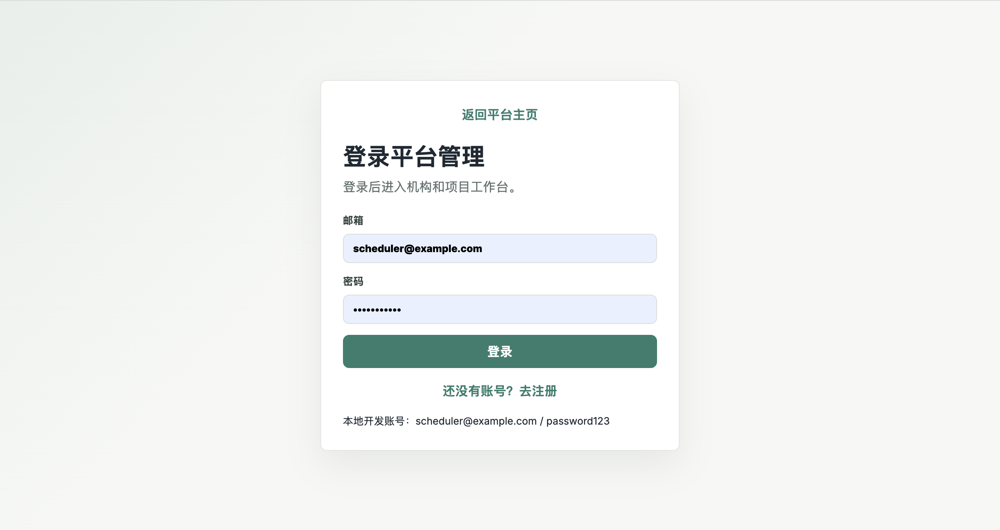
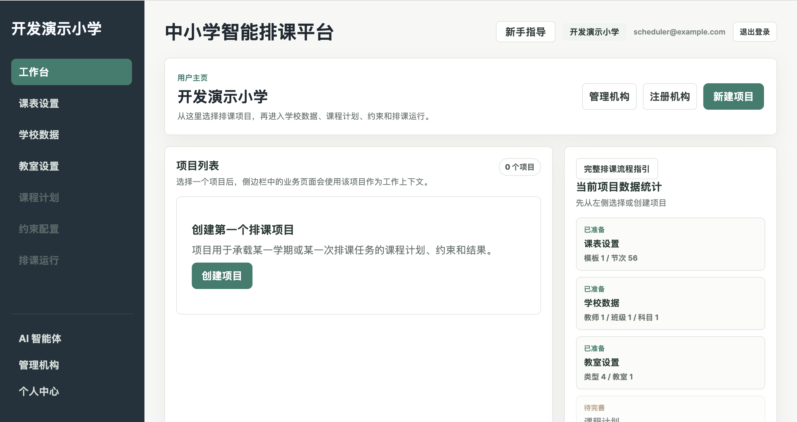
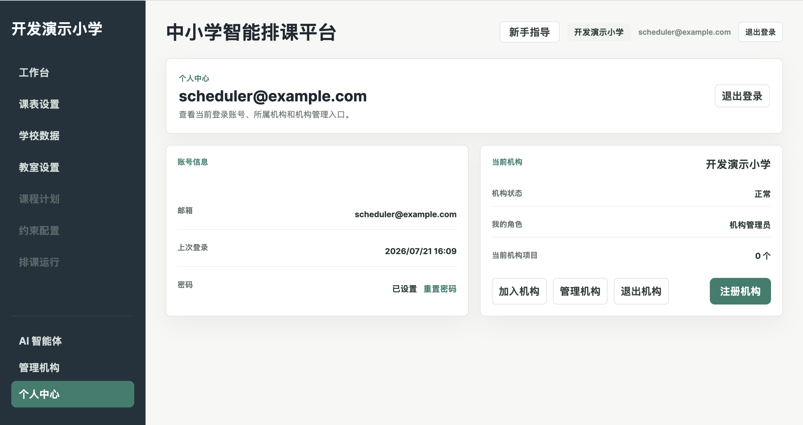
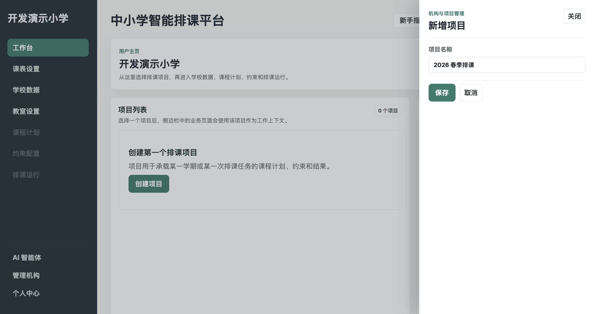
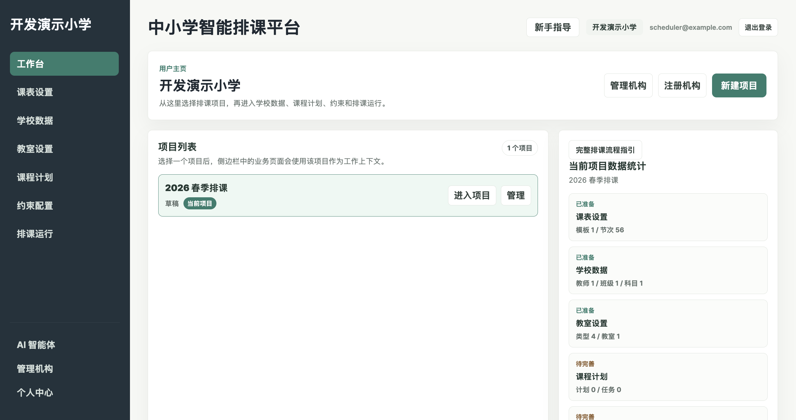
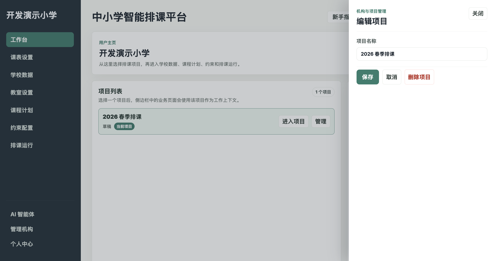
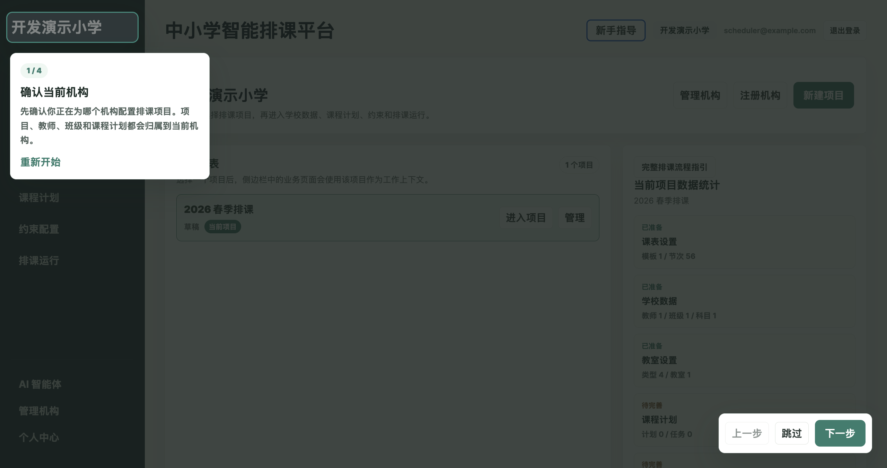

# 账号、机构与项目使用指南

## 1. 账号、机构和项目的关系

账号可以加入一个或多个机构。学校数据和排课项目归属于当前机构；课程计划、约束、排课运行和候选课表归属于当前项目。

操作业务页面前，请同时确认页面左侧的机构简称和页面上方的“当前项目”。切错机构或项目会看到另一套数据。

## 2. 平台主页

链接：[平台主页](https://jqvyybbrdduk.sealosbja.site/)

### 可用操作

- “进入平台管理”：已有账号进入登录页；已登录时进入管理端。
- “用户注册”：进入注册页。
- “联系合作”：商务合作、产品反馈（开发中，未上线）。
- “软件下载”：下载桌面端离线版（开发中，未上线）。

### 建议操作流程

1. 新用户点击“用户注册”。
2. 已有账号点击“进入平台管理”。

## 3. 注册账号

链接：[用户注册页](https://jqvyybbrdduk.sealosbja.site/register)

1. 输入注册邮箱。
2. 输入符合条件的密码。
3. 再次输入密码。
4. 点击“注册”。
5. 若系统提示需要邮箱确认，进入邮箱完成确认后再登录。

密码和确认密码必须一致。请勿在公共设备保存账号密码。

## 4. 登录与退出

### 登录

链接：[用户登录页](https://jqvyybbrdduk.sealosbja.site/login)

1. 输入邮箱和密码。
2. 点击“登录”。
3. 登录成功后进入机构和项目工作台。

### 退出

点击页面右上角的“退出登录”。退出后刷新重新进入登录流程。

## 5. 重置密码（开发中，未上线）

1. 进入“重置密码”。
2. 输入注册邮箱。
3. 点击“发送重置邮件”。
4. 打开邮件中的链接继续完成密码修改。

如果长时间未收到邮件，先检查垃圾邮件和输入的邮箱；仍未收到时联系平台管理员检查邮件服务。

## 6. 个人中心

个人中心显示：

- 当前账号邮箱。
- 上次登录时间。
- 密码重置入口。
- 当前机构、机构状态、本人角色和项目数量。

可从个人中心发起加入机构、管理机构、退出机构或注册机构。

## 7. 申请加入机构

1. 在个人中心点击“加入机构”。
2. 输入机构全称。当前查询采用精确匹配，简称或多余空格可能无法匹配。
3. 点击“查询机构”。
4. 确认匹配结果。
5. 填写姓名、岗位或加入原因等申请说明。
6. 点击“提交加入申请”。
7. 等待机构管理员通过或驳回。

提交申请不会立即获得机构数据访问权。

## 8. 注册新机构

1. 在工作台或个人中心点击“注册机构”。
2. 填写真实手机号、微信号、机构名称、地址和用途等信息。
3. 点击“提交审核”。
4. 等待平台管理员审核。
5. 审核通过后系统创建机构，并将申请账号设置为机构管理员。

普通用户注册机构时，提交的是机构注册申请，审核通过后机构才会创建。审核流程大约持续3-7个工作日。届时会有平台运营人员添加微信，请按照其指引提供相关资料，以供认证。

## 9. 退出机构

1. 在个人中心确认当前机构。
2. 点击“退出机构”。
3. 按提示确认。

当前账号如果是机构唯一管理员，系统会阻止退出。应先将其他成员设为管理员，或按管理流程注销机构。

## 10. 工作台与项目

### 新建项目

1. 点击“新建项目”。
2. 输入项目名称，例如“2026 春季排课”。
3. 点击“保存”。
4. 回到项目列表选择新项目。

建议一个项目只承载一个学期或一次明确的排课任务，不要把多年数据混在同一项目。

### 选择项目

1. 在工作台确认当前机构。
2. 在“项目列表”点击项目主体，将它设为当前项目。
3. 点击“进入项目”进入业务页面。
4. 页面上方持续显示当前项目名称。

### 管理项目

1. 在项目卡片点击“管理”。
2. 修改项目名称并保存，或按需删除项目。
3. 删除前确认项目中的课程计划、约束、运行结果是否仍需保留。

删除项目属于高影响操作。操作前应先完成所需导出或备份。

### 数据统计和完整流程指引

工作台右侧显示课表设置、学校数据、教室、课程计划、约束和排课运行的准备状态。点击某一项可进入对应页面；点击“完整排课流程指引”可按页面逐步浏览系统内置的新手指引。

## 11. 页面级新手指导

页面右上角的“新手指导”会定位当前页面的关键区域。弹出栏或约束编辑器中也有独立的新手指导。指引只解释页面，不会替用户保存数据。
