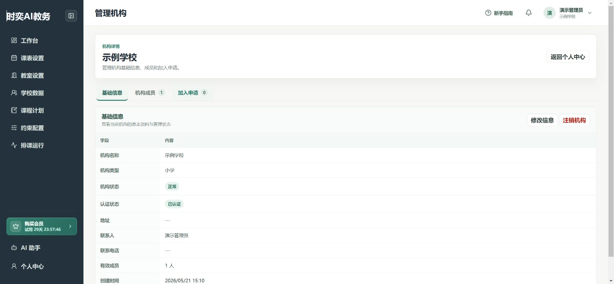

# 让同事一起使用

每位同事使用自己的账号，加入同一所学校。不要共用管理员账号。

## 第1步：告诉同事学校全称

在 **工作台** 确认当前机构名称，把学校完整名称告诉同事。

同事注册并登录后，在 **个人中心 → 加入机构** 查询学校，填写申请说明并提交。[注册和加入步骤](./start/accounts-organizations-projects.md)

## 第2步：管理员审核加入申请

1. 在 **工作台** 点击 **管理机构**。
2. 打开 **加入申请**。
3. 核实申请人确实是本校同事，再通过或驳回申请。

下图是暂无申请时的页面。有申请后，列表中会显示申请信息及对应操作。

## 第3步：检查成员和项目

打开 **机构成员**，确认同事已经加入。让对方返回工作台，选择约定好的排课项目。

看不到“管理机构”或成员操作时，请联系本校机构管理员，不要重新注册一个同名学校。

## 第4步：先分工，再修改

可以约定一人维护教师和班级，一人维护课程计划，由排课负责人统一发起排课和导出。

避免两个人同时修改同一个班的同一个科目。对方完成修改后，重新打开对应页面查看最新数据。

## 交接或离职时

由机构管理员检查成员名单，按实际职责调整角色或移除不再参与的成员。管理员交接时先确认接替人已经具备管理权限。

**注销机构不是退出账号，也不是退出项目。** 不要为了更换负责人而注销学校。

## 完成后检查

- [ ] 每人使用独立账号。
- [ ] 同事加入的是正确学校。
- [ ] 大家选择的是同一个排课项目。
- [ ] 已明确谁负责哪些数据、谁负责发布课表。
