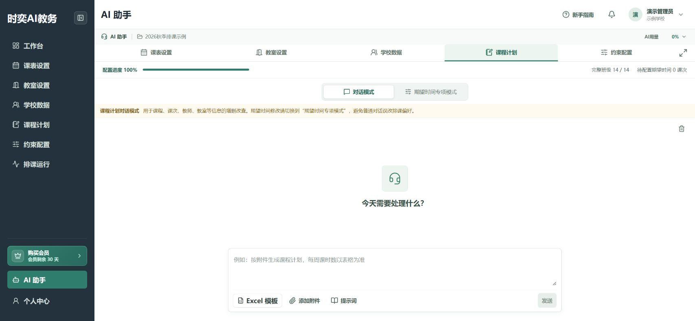
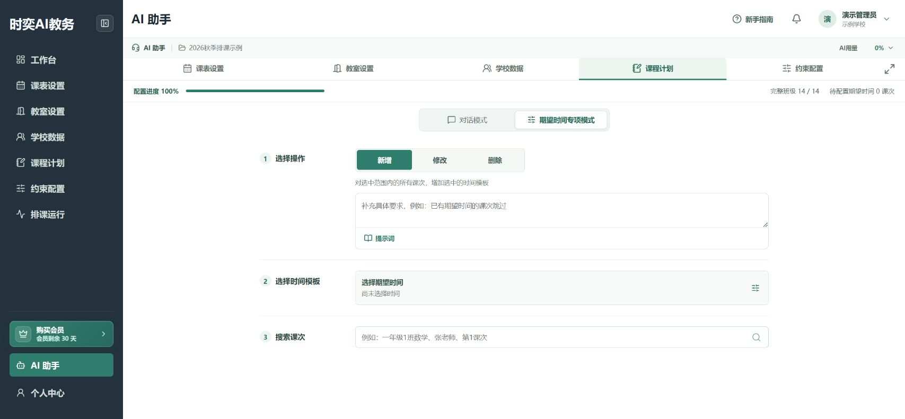
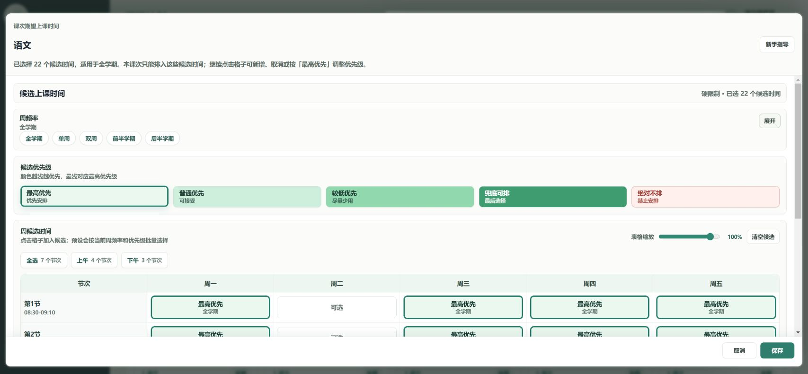

# 用 AI 辅助录入

**入口：左侧“AI 助手”。**

AI 可以减少重复录入，但仍需要你检查班级、教师、数量和修改范围。

## 第1步：确认项目，选择场景

确认顶部显示的是本次排课项目，再选择 **课表设置、教室设置、学校数据、课程计划** 或 **约束配置**。

例如修改任课教师，选择“课程计划”，不要放在课表模板识别中处理。

## 第2步：说清楚要改什么

输入具体要求，也可以点击 **添加附件** 选择资料，确认附件已加入后再点击 **发送**。

可以这样说：

> 把七年级1班的数学任课教师改为王老师，保留原来的课次数、教室和期望时间。

> 将七年级所有体育课设为“不使用教室”，不要只清空教室名称。先列出涉及的班级供我核对。

需要整理表格时，优先使用当前场景提供的 **Excel 模板**。

## 第3步：核对后再执行

AI 提出补充问题时，先回答清楚。出现待确认的变更明细时，检查新增、修改或删除了哪些数据，再点击 **确认执行**。

如果班级、数量或字段不对，不要确认，先补充要求。看到执行成功后，到对应业务页面抽查一条记录。

## 第4步：批量改时间，使用专项模式

在 **课程计划 → 期望时间专项模式** 中依次操作：

1. 选择 **新增、修改** 或 **删除**，阅读当前操作说明。
2. 点击 **选择期望时间**，核对教学周、星期和时间段。
3. 搜索课次，勾选本次要处理的课次。
4. 核对选中课次数与时间范围，点击 **确认应用**。

“删除”会减少可选时间，操作前尤其要看清范围。应用成功后，本次输入会清空，课程计划数据会更新。

## 第5步：抽查一个课次

到 **课程计划** 打开刚处理的科目，进入 **编辑课次 → 选择期望时间**，确认不同星期都保留了需要的时段。

不要只看进度达到100%，还要看实际选中的时间是否符合要求。

## 使用前记住

- 附件上传完成不等于数据已经保存。
- 普通对话以变更确认结果为准；专项模式的“确认应用”会提交本次操作。
- AI 用量可在顶部 **AI用量** 查看。不要为了重试同一个问题连续重复发送。
- 大批量修改前，先用一个班或一个科目试一次。

返回[课程计划指南](./course-plans.md)。
