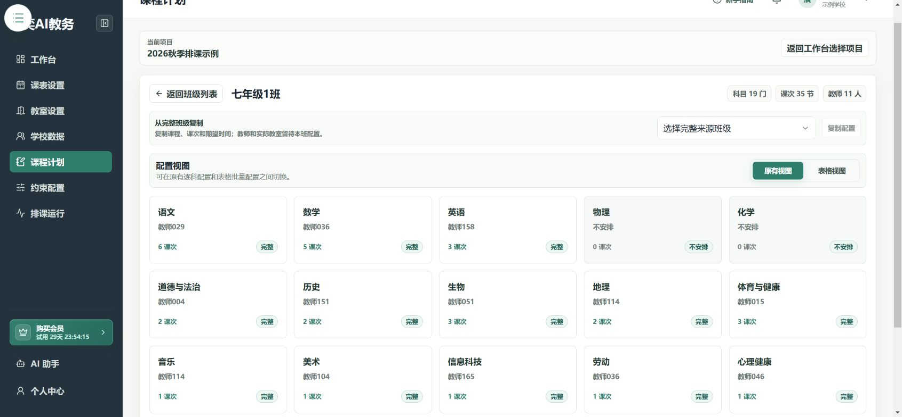
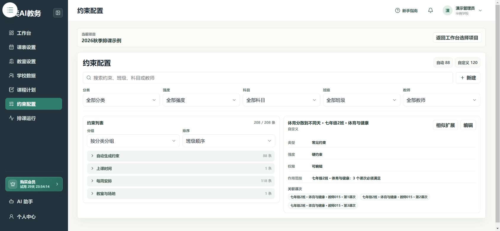

# 设置排课要求

**入口：左侧“约束配置”。**

约束就是排课规则，例如“两门课不能同时上”。先完成课程计划，再添加约束。

## 第1步：先看已有规则

在列表中搜索已有约束，避免重复添加。系统自动生成的规则与自己创建的规则会分别显示。

## 第2步：选择一个常见规则

点击 **新建 → 常见约束**，按类别选择规则，先读规则下面的解释和示例。

例如要避免两组课同时上，选择 **这些课不能同时上**，不要只在名称中写要求。

## 第3步：选中涉及的课次

按班级、科目、教师逐级查找，把目标课次加入选中列表。

核对右侧选中的班级和课程，避免把全校课程误加到只针对一个班的规则中。

## 第4步：选择强度并确认创建

1. 必须遵守的要求，勾选 **硬约束（必须满足）**。
2. 只是希望尽量满足的要求，不要设为硬约束。
3. 点击 **下一步：相似扩展**。
4. 只需要当前规则时，选择 **不扩展，仅创建原约束**；要应用到相似对象时，核对扩展组后点击 **确认创建所选约束**。

相似扩展是把同类要求应用到其他对象，不是排课必做步骤。

## 第5步：返回列表检查

确认新规则已经出现。点击规则查看关联课次，发现选错时使用 **编辑** 修改并保存。

## 完成后检查

- [ ] 规则含义与自己的要求一致。
- [ ] 关联课次没有漏选或多选。
- [ ] 偏好没有全部设成硬约束。
- [ ] 新规则已经出现在列表中。

下一步：[开始排课并检查结果](./scheduling-results.md)。
