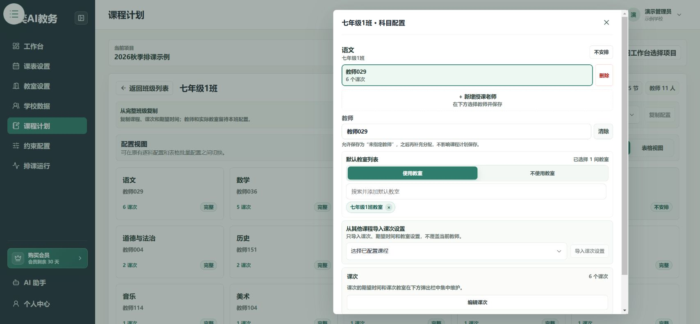
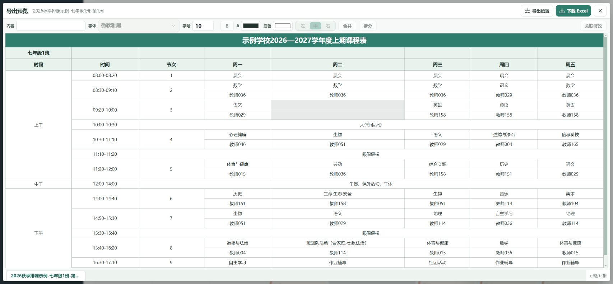

# 遇到问题怎么办

## 看不到学校或项目

1. 确认登录的是自己的账号。
2. 到个人中心检查加入机构的申请是否已通过。
3. 回到工作台，确认当前学校，再选择项目。

没有通过审核时，联系学校管理员。[账号与项目指南](./start/accounts-organizations-projects.md)

## 为什么班级进度没有达到100%？

打开 **课程计划**，使用配置状态筛选，检查缺教师、缺教室或缺期望时间的科目。

进度只是资料检查结果。即使100%，仍可能存在互相冲突的排课要求。

## 体育课不需要教室，应该怎么填？

打开该科目的配置，在默认教室列表选择 **不使用教室**，再保存授课任务。

不要只删除教室名称。**“不用教室”和“需要教室但还没选”是两回事。**

## 为什么只排在周一？

1. 打开一个受影响的课次，点击 **选择期望时间**。
2. 检查周二到周五是否也选中了候选时段。
3. 检查是否误选了“绝对不排”，或被其他约束限制。
4. 保存时间，再点击 **保存授课任务**，然后重新排课。

“全学期”表示适用教学周，不表示已经选中了所有星期。

## 选择了时间，为什么重新打开没有保存？

在时间弹窗中保存后，还要回到课次或科目配置，点击 **保存授课任务**。只关闭弹窗不会代替保存。

## 找不到可复制的来源班级

先完成一个班级的课程配置，并处理它缺少的教师、教室或期望时间。通过完整性检查后，再到目标班级选择来源。

## 显示“可以发起排课”，为什么还有课没排进去？

“可以发起”只表示通过了排课前检查，不保证所有规则能同时满足。

展开 **未排入课次**，检查可选时间是否太少、教师是否同时被多门课占用，以及硬约束是否互相冲突。调整后重新排课。

## AI 说处理了，实际数据却不对

先查看本次变更是否真正执行成功，再到业务页面打开一条记录核对。

反馈时写清项目、班级、科目、课次和预期结果。不要只重复发送“再试一次”。[AI 操作步骤](./ai-agent.md)

## 导出 Excel 为什么不是我要的班级或周？

关闭预览，回到候选课表，重新选择视图、对象和教学周，再导出。还要检查导出设置是“当前”还是“全部”。

## 打印时留白太多，怎么办？

先在导出设置中选择正确纸张方向，再重新下载。文件会按 A4 一页调整布局。

打开 Excel 或 WPS 的打印预览，确认没有改成其他纸型或额外缩放。屏幕上的预览缩放不会改变打印尺寸。

## 快照和 Excel 有什么区别？

- **候选课表快照**：在系统内保留一个课表版本，之后可以重现。
- **Excel 课表**：用于查看、打印或发给教师。
- **JSON 项目数据快照**：保留排课前的项目资料，不是可打印课表。

## 页面上的词是什么意思？

| 页面用词 | 简单理解 |
| --- | --- |
| 机构 | 你所在的学校或单位 |
| 项目 | 本次排课任务 |
| 课表模板 | 一周的表格、作息时间和显示样式 |
| 授课任务 | 某班某门课由谁教、怎么安排 |
| 课次 | 一次需要安排的课 |
| 教学周 | 第1周、第2周等 |
| 期望时间 | 课次可选择的时间及偏好 |
| 硬约束 | 必须满足的排课规则 |
| 软约束 | 尽量满足的偏好 |
| 候选课表 | 系统生成、仍需检查的课表 |
| 缓冲区 | 暂时没有放入表格的课次区域 |

仍无法解决时，记录操作步骤、页面提示、项目和班级名称，并截取相关区域发给管理员。截图前遮住密码、验证码等信息。
