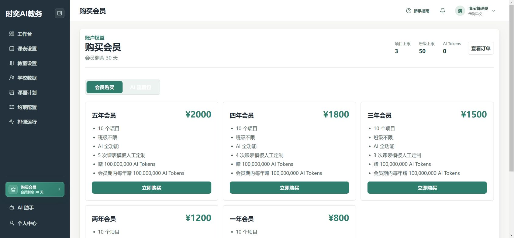
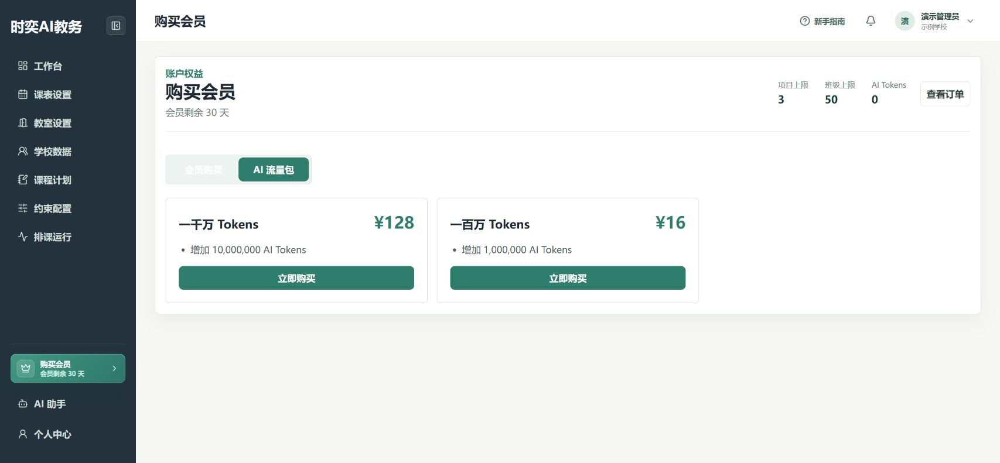
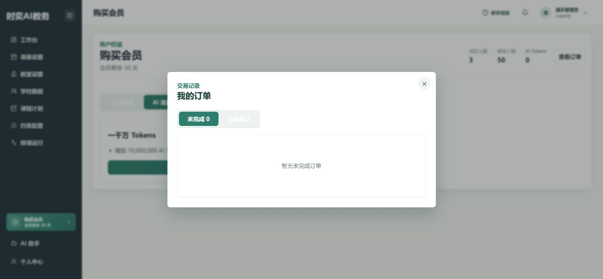

# 充值相关

**入口：左侧“购买会员”。** 这里可以购买会员，也可以补充 AI 使用额度。

## 第1步：确认账号和当前额度

1. 看右上角，确认登录的是需要购买服务的账号。
2. 点击左侧 **购买会员**。
3. 查看会员剩余时间、项目上限、班级上限和 **AI Tokens**（AI 使用额度）。

如果提示需要验证邮箱，先按页面提示完成验证，再回来购买。

## 第2步：选择要购买的服务

| 你的需要 | 选择哪个入口 |
| --- | --- |
| 开通或续费会员 | **会员购买** |
| 会员仍有效，但 AI 额度不够 | **AI 流量包** |

购买会员时，比较套餐的有效期、项目和班级上限、AI 额度等内容。补充 AI 额度时，切换到 **AI 流量包**，选择需要的额度。

**AI 流量包仅供有效会员购买，不等于续费会员。** 套餐价格和权益以购买页面为准，截图仅作操作示例。

## 第3步：核对金额，用微信支付

1. 确认套餐后，点击对应的 **立即购买**。
2. 在支付窗口核对商品名称、金额和订单有效期。
3. 打开手机微信，扫一扫窗口中的二维码，核对收款信息后完成支付。
4. 回到电脑，等待出现 **支付成功** 和 **权益已经到账**，再点击 **完成**。

**只点击“立即购买”或关闭窗口，不代表已经付款。** 不要扫描文档或他人截图中的支付码；请使用自己账号实时生成的二维码。

本指南不展示真实支付二维码，也未进行演示付款。

## 第4步：确认到账，查询订单

1. 回到 **购买会员**，核对会员剩余时间或 **AI Tokens** 是否更新。
2. 点击右上方 **查看订单**。
3. 在 **已完成** 中核对购买记录；尚未支付且仍有效的订单可在 **未完成** 中点击 **继续支付**。

下图是演示账号的空订单列表，实际购买后才会出现订单记录。

## 第5步：需要报销时申请发票

1. 打开 **查看订单 → 已完成**，找到对应订单，点击 **申请发票**。
2. 选择 **个人** 或 **企业**，填写发票抬头；企业还需填写纳税人识别号。
3. 填写接收邮箱，检查无误后点击 **提交开票申请**。
4. 后续在该订单查看开票状态。出现 **下载发票** 后可下载，也请留意接收邮箱。

学校报销前，先向财务确认抬头、识别号和开票要求，不要自行猜填。

## 遇到问题怎么办

| 问题 | 先这样处理 |
| --- | --- |
| “立即购买”不能点击 | 检查是否已验证邮箱；购买 AI 流量包还需会员有效。 |
| 二维码已失效 | 先确认微信没有扣款，再关闭失效窗口，重新选择套餐生成订单。 |
| 微信已扣款，页面仍未到账 | 不要重复付款。重新打开购买页面和订单列表；仍异常时，保留订单号、付款时间和金额，联系平台工作人员核查。 |
| 找不到订单 | 先核对是否登录了购买时的账号，再检查“未完成”和“已完成”。 |
| 有 AI 额度，却不能使用 AI | 同时检查会员状态和页面错误提示；流量包不能代替有效会员。 |
| 开票显示“未通过” | 打开对应开票记录，核对资料，并联系平台工作人员确认处理方式。 |

向工作人员反馈时，不要提供密码、验证码或完整付款二维码。不要在公开群聊中发送付款凭证和开票资料。
