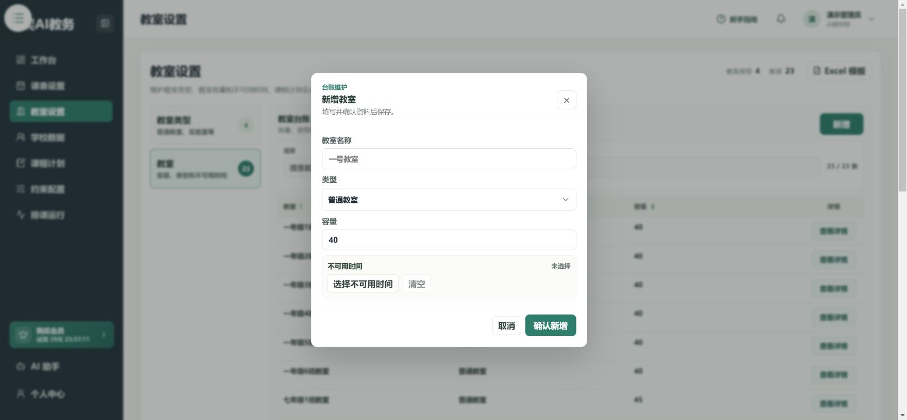

# 录入教室和停用时间

**入口：左侧“教室设置”。**

先添加类型，再添加具体教室。例如“音乐教室”是类型，“音乐楼101”是具体教室。

## 第1步：添加教室类型

在教室类型区域点击 **新增**，填写类型名称，按需要填写说明，点击 **确认新增**。

已有合适类型时，直接使用，不用重复创建。

## 第2步：添加教室

在教室区域点击 **新增**，填写教室名称、选择类型、填写容量。

教室名称要能区分具体场地，例如“一年级1班教室”，不要把所有普通教室都叫“普通教室”。

## 第3步：有停用时间时再设置

1. 点击 **选择不可用时间**。
2. 选择适用教学周、星期和时间段。
3. 核对后点击 **添加不可用时间**。
4. 回到教室表单，点击 **确认新增**；修改已有教室时点击对应保存按钮。

没有停用时间就跳过这一项。不要把“可以使用的时间”填进不可用时间。

## 第4步：在课程计划中使用教室

教室建好后，还需要在课程计划中给课程选择默认教室或课次教室。

体育等课程确实不需要教室时，应明确选择 **不使用教室**，不是把教室留空。[查看课程计划](./course-plans.md)

## 完成后检查

- [ ] 教室名称、类型、容量正确。
- [ ] 不可用时间没有选反。
- [ ] 回到表单完成了保存。
