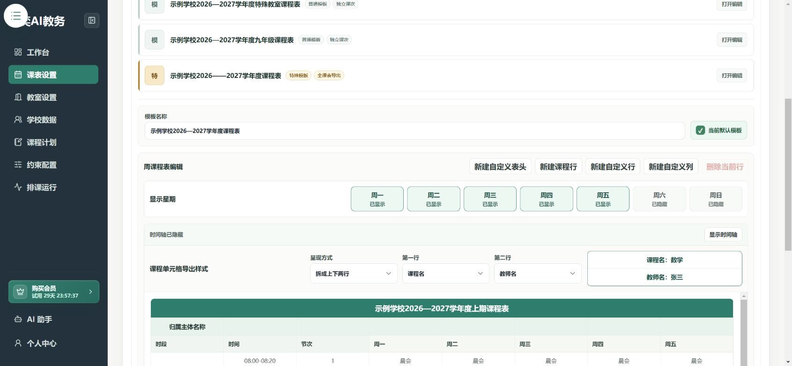

# 设置一周的课表

**入口：左侧“课表设置”。**

这里先确定“哪些时间可以放课程”，再决定课表长什么样。暂时不用填写任课教师。

## 第1步：确认学期周数和模板

1. 确认 **学期周数**。
2. 在 **本项目模板** 中选择要使用的模板；没有合适的模板时点击 **新建**。
3. 填写模板名称，确认本项目的默认模板。

## 第2步：设置上课星期和课程行

1. 在 **显示星期** 中保留实际需要上课的星期。
2. 点击 **新建课程行**，设置上课时间和课程内容的位置。
3. 逐行核对开始、结束时间，避免时间重叠或漏掉一节课。

**课程行** 是算法可以安排课程的地方。午休、眼保健操等固定文字，使用 **自定义行**，不要当成需要排课的课次。

## 第3步：整理课表样式并保存

按需要添加自定义表头、行或列，核对课程名称、教师名称的显示方式，最后点击 **保存**。

不需要显示系统时间轴时，可以隐藏时间轴；隐藏显示不等于取消实际的上课时间。

## 第4步：检查导出效果

点击 **导出Excel预览**，检查标题、星期、时间和固定活动是否完整。正式排好课后，还要到排课运行页面导出带课程的课表。

## 已有 Excel 课表怎么办？

可以从 **AI 助手 → 课表设置** 使用 Excel 识别。上传后先核对标题区、主表头、课程单元格和自定义单元格，再生成预览并保存。

合并的表头或固定活动应作为完整单元格核对，不要把其中的空白部分误标成课程。

[查看 AI 助手操作](./ai-agent.md)。

## 完成后检查

- [ ] 学期周数、上课星期正确。
- [ ] 每节课的起止时间正确。
- [ ] 固定活动和可排课程区分清楚。
- [ ] 已点击保存。

下一步：[录入教师、班级和科目](./school-data.md)。
