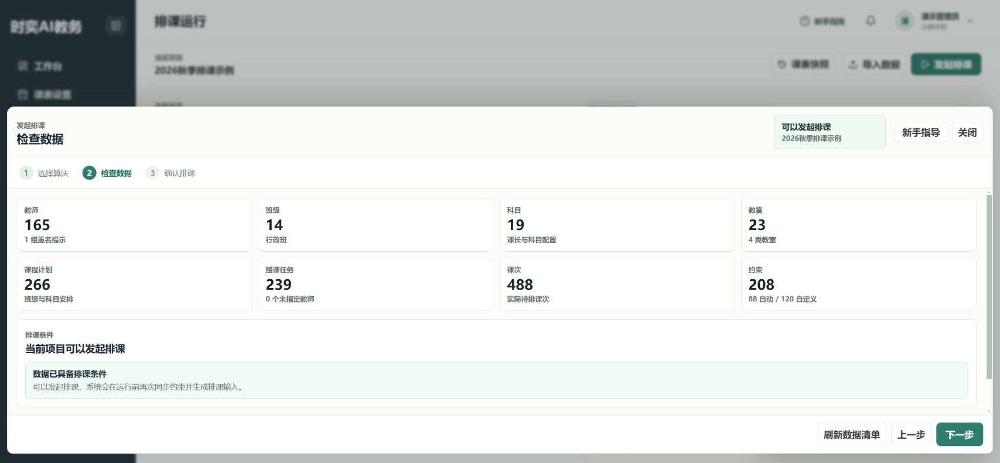
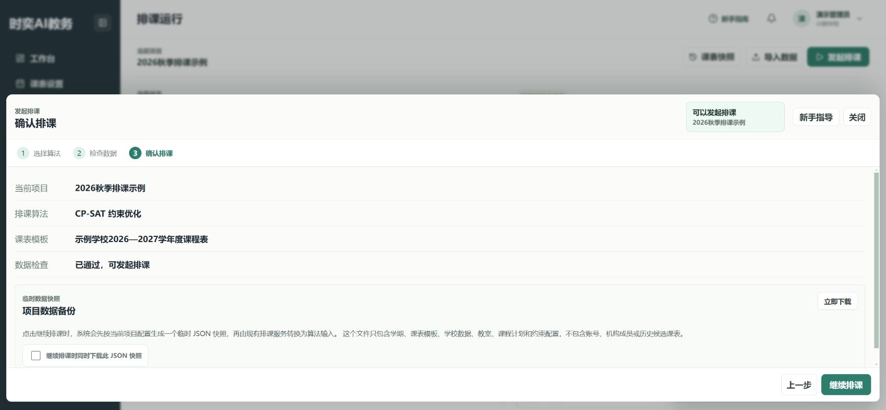
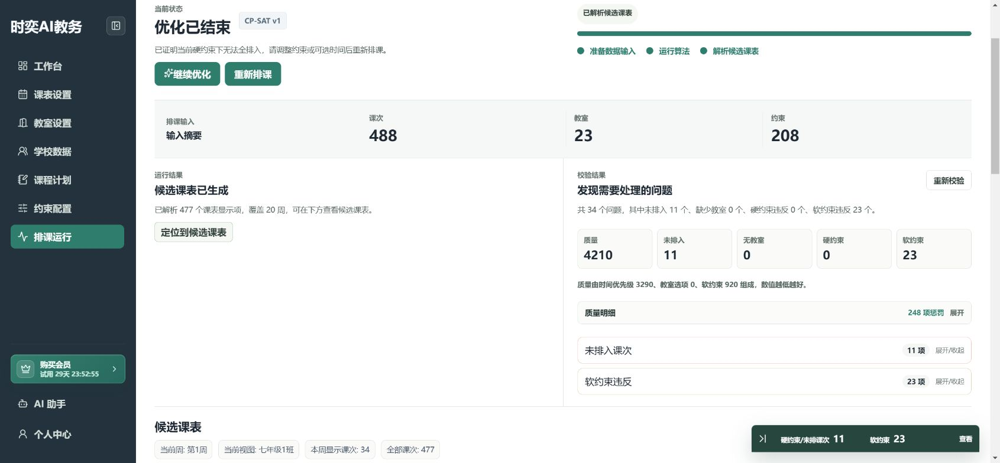
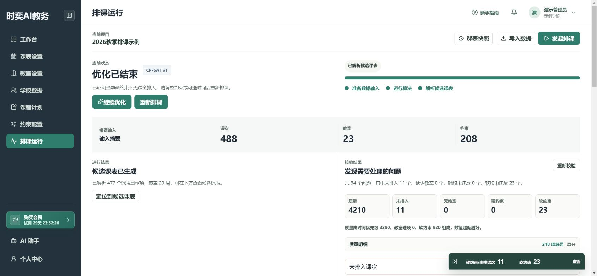

# 排课、调课和导出

**入口：左侧“排课运行”。**

先检查数据，再开始排课。生成候选课表后，还要检查有没有漏排或冲突。

## 第1步：选择算法

点击 **发起排课**，在“选择算法”中选择：

| 算法 | 什么时候用 |
| --- | --- |
| CP-SAT 约束优化 | 不确定时先用默认选项，适合需要综合考虑多种要求的排课 |
| 贪心排课 | 想快速查看一版初步安排 |
| 随机多起点排课 | 想通过多次尝试寻找其他安排 |

阅读页面介绍后点击 **下一步**。换算法不保证解决互相矛盾的要求。

## 第2步：检查数据

检查班级、课次、教室和约束数量。有提示时展开 **查看详情**，点击对应记录的 **前往配置** 处理。

修改数据后重新进入排课检查，必要时点击 **刷新数据清单**。

## 第3步：确认并开始

核对项目、算法等信息后，点击 **继续排课**，等待页面显示运行结果。

需要保留排课前资料时，可以同时下载 **JSON 项目数据快照**。它是数据备份，不是给教师打印的课表。

## 第4步：先处理结果中的问题

优先查看：

- **未排入**：还有课程没有放进课表。
- **无教室**：需要使用教室的课程缺少场地安排。
- **硬约束**：有必须满足的要求未满足。
- **软约束**：有偏好未满足，需要判断能否接受。

下图是有未排入课次的示例，不是已经可以发布的最终课表。调整课程计划或约束后，需要重新排课；仅修改资料不会自动修好已有候选课表。

## 第5步：按班级或教师查看课表

在候选课表上方选择 **按班级、按教师** 等视图，再选择对象和教学周。

单双周安排不同时，要分别查看对应周。缓冲区中的课次也要检查，不能因为表格已有课程就忽略它们。

## 第6步：需要时手动调课

单击课次后选择目标位置，或拖动课次移动、交换。长按课次可以查看详情。

不确定哪些位置可用时，先使用 **查看可交换课次** 或 **查看可移动课次**。调整后检查冲突提示，并点击 **重新校验**。

不要只在导出预览中改文字来代替调课，那不会改变实际排课位置。

## 第7步：保存候选课表快照

1. 点击页面上方的 **候选课表快照**。
2. 填写便于区分的名称，例如“第一次排课”“调整体育课后”。
3. 点击 **保存当前课表**。
4. 以后在快照列表中点击 **重现**，查看已保存的版本。

运行结束并有候选课表后才能保存。快照用于保留课表版本，不等于把课程计划、教师资料等全部回滚。

## 第8步：预览并下载 Excel

1. 选择要导出的视图、班级或教师，以及教学周。
2. 点击 **导出**。
3. 点击 **导出设置**，选择当前对象或全部对象、黑白或彩色、横向或纵向。
4. 检查表格后点击 **下载 Excel**。

导出全部对象时，可以通过底部工作表标签检查各张表。

## 第9步：检查打印效果

导出会按所选方向设置 A4 纸张，并调整行列尺寸，让每张工作表尽量铺满一页。

在 Excel 或 WPS 中打开文件，进入打印预览，确认纸张方向、内容完整性和字号。不同打印机的可打印边距可能不同，正式批量打印前先试打一页。

页面中的 **预览缩放** 只改变屏幕显示大小，不是打印缩放。

## 发给教师前检查

- [ ] 未排入课次、教室问题和硬约束冲突已处理。
- [ ] 班级、教师与教学周选择正确。
- [ ] 调课后已经重新校验。
- [ ] 已保存快照。
- [ ] Excel 打印预览中内容完整、文字可读。
