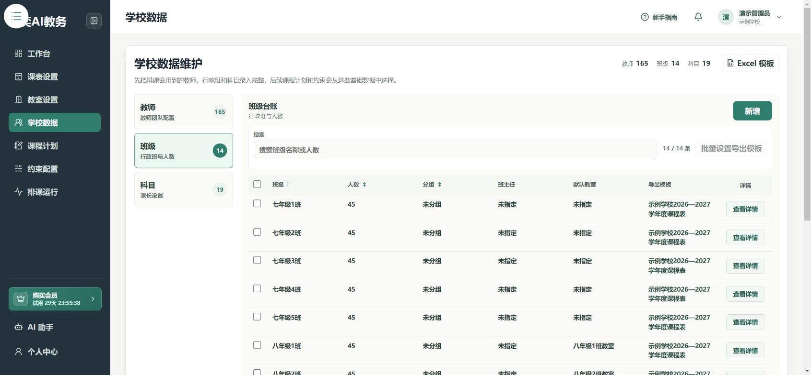
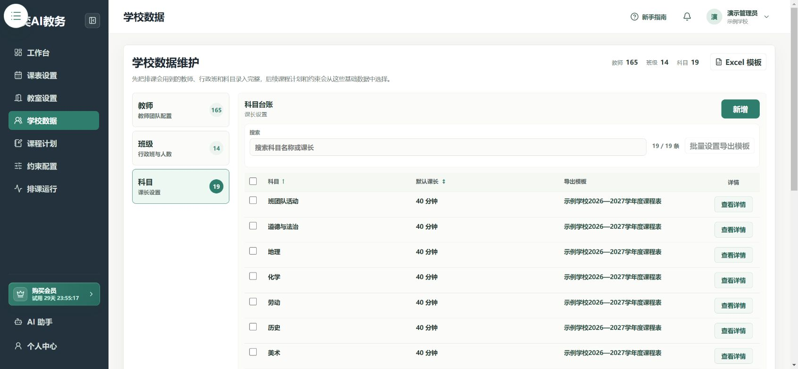

# 录入教师、班级和科目

**入口：左侧“学校数据”。**

先搜索已有记录。名单里已经有的人或科目，不要再新增一遍。

## 第1步：添加教师

1. 选择 **教师 → 新增**。
2. 填写教师姓名，按需要选择分组标签。
3. 点击 **确认新增**，检查教师是否出现在列表中。

分组只是为了更容易查找，例如语文组、数学组。

## 第2步：添加班级

1. 选择 **班级 → 新增**。
2. 填写班级名称、人数和分组。
3. 选择班主任；已录入教室时，可选择默认教室。
4. 点击 **确认新增**。

如果暂时还没有教室，可以先完成班级录入，录入教室后再回来补充。

## 第3步：添加科目

1. 选择 **科目 → 新增**。
2. 填写科目名称和默认课长，例如数学、40分钟。
3. 点击 **确认新增**。

同一科目尽量使用统一名称，不要同时建立“体育”和“体育与健康”来表示同一门课。

## 第4步：检查或修改已有记录

在对应分类中搜索名称，点击记录的 **查看详情**，修改后按表单中的保存按钮提交。不要通过重复新增来修改旧记录。

数据较多时，可使用页面的 **Excel 模板**，按模板要求整理；需要 AI 协助录入时，查看 [AI 助手](./ai-agent.md)。

## 完成后检查

- [ ] 教师、班级和科目名称没有重复或错字。
- [ ] 班级人数与默认教室已核对。
- [ ] 科目默认课长正确。

下一步：[录入教室](./room-settings.md)。已经录好教室可以进入[课程计划](./course-plans.md)。
