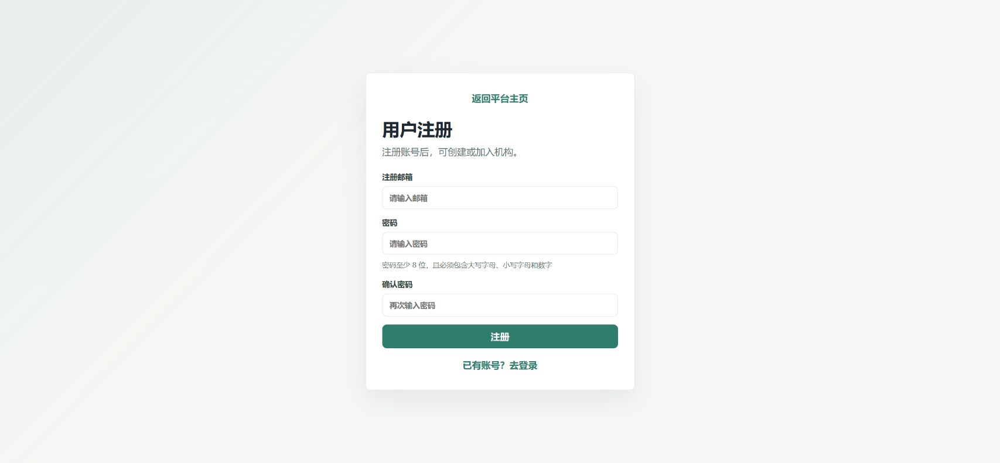
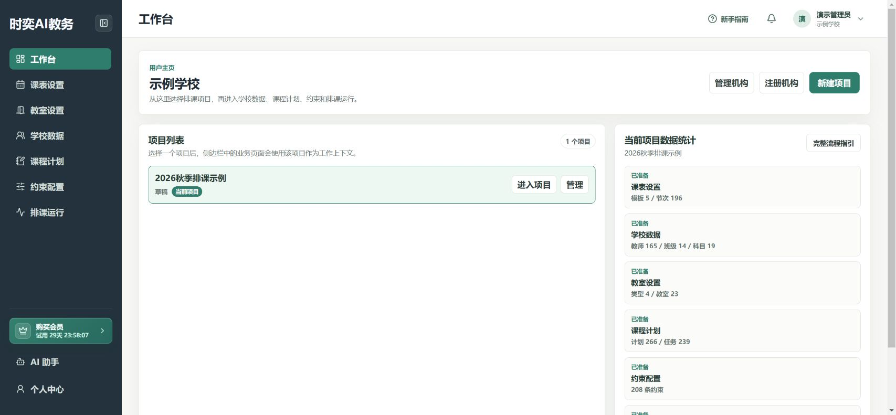

# 注册、登录和选择项目

已有账号和项目，可以直接看第4步。

## 第1步：注册并登录

1. 打开平台主页，点击 **用户注册**。
2. 填写邮箱和密码，再输入一次相同的密码，点击 **注册**。
3. 如提示验证邮箱，先打开邮件完成验证。
4. 返回登录页，用注册邮箱和密码登录。

## 第2步：加入学校，或申请创建学校

**学校已经在使用平台：** 打开 **个人中心 → 加入机构**，输入学校完整名称并查询，确认学校无误后填写申请说明，提交加入申请，等待学校管理员审核。

**你是学校第一次使用的人：** 在工作台或个人中心点击 **注册机构**，按表单填写机构名称、联系方式和用途，提交审核。审核通过后再进入学校。

不要为加入已有学校而重复注册机构。申请已提交，不代表已经审核通过。

## 第3步：创建本次排课项目

1. 打开 **工作台 → 新建项目**。
2. 输入容易辨认的名称，例如“2026年秋季排课”。
3. 点击 **保存**。

同事已经创建好项目时，直接选择现有项目，不必重复创建。

## 第4步：进入项目

在工作台的 **项目列表** 找到项目，点击 **进入项目**。开始录入前，再确认页面上的当前项目名称。

需要换项目时，回工作台重新选择。

## 第5步：使用完后退出账号

在公共电脑上，点击右上角账号菜单，选择 **退出登录**。不要把自己的账号和密码交给同事，协作时让对方申请加入学校。

## 完成后检查

- [ ] 已登录自己的账号。
- [ ] 当前机构是自己的学校。
- [ ] 当前项目名称正确。

下一步：[第一次排课：跟着做](./complete-workflow.md)。
