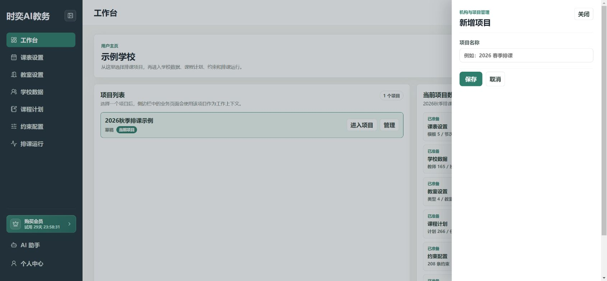
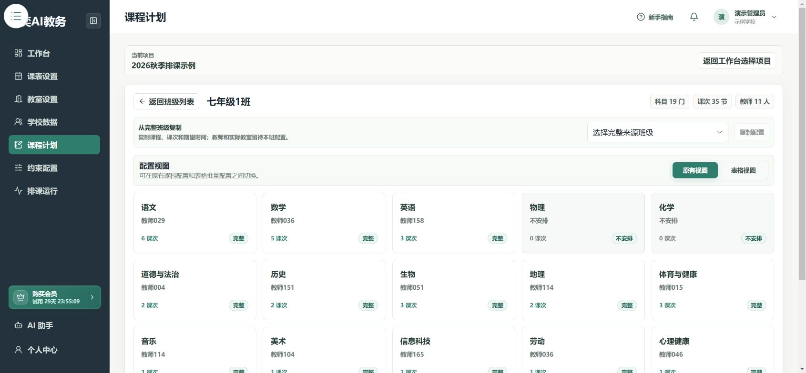
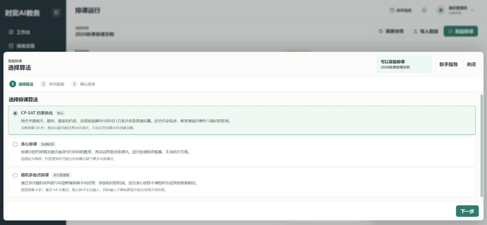
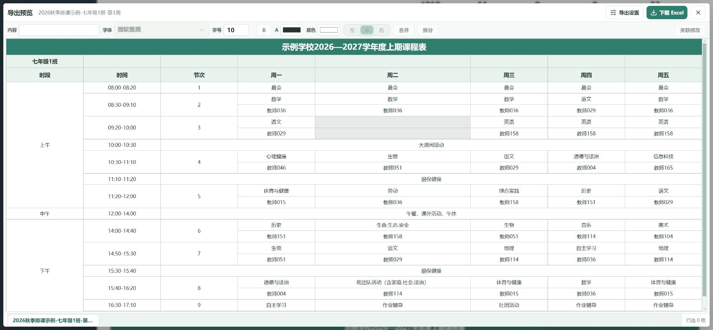

# 第一次排课：跟着做

已经登录并加入学校后，从第1步开始。还没有账号？先看[注册与登录](./accounts-organizations-projects.md)。

## 第1步：创建本次排课项目

在 **工作台 → 新建项目** 输入项目名称，点击 **保存**，然后进入该项目。

## 第2步：设置一周的作息

打开 **课表设置**，确认学期周数、上课星期和各节课时间，完成后点击 **保存**。

先用一个默认模板即可，不必一开始就为每个班设计不同样式。[详细步骤](../schedule-settings.md)

## 第3步：录入教师、班级和科目

打开 **学校数据**，分别进入教师、班级、科目，点击 **新增**。填好后点击 **确认新增**。

已有正确记录就直接使用，不要重复添加。[详细步骤](../school-data.md)

## 第4步：录入教室

打开 **教室设置**，先添加教室类型，再添加教室。有停用时段时，再设置不可用时间。[详细步骤](../room-settings.md)

## 第5步：完成一个班的课程计划

打开 **课程计划**，选择一个班级，再逐门打开科目，设置任课教师、教室和课次。

每个课次都要核对可上课时间。完成后点击 **保存授课任务**。[详细步骤](../course-plans.md)

## 第6步：复制到相似班级

打开目标班级，在 **从完整班级复制** 中选择已完成的班级，点击 **复制配置**。

复制后检查目标班级的教师、实际教室及特殊课程，不要把“复制成功”当成“全部配置完成”。

## 第7步：添加必要的排课要求

打开 **约束配置 → 新建**，选择规则和相关课次。先添加必须遵守的要求，偏好要求不要都设为硬约束。[详细步骤](../constraints.md)

## 第8步：发起排课

打开 **排课运行 → 发起排课**，依次完成 **选择算法 → 检查数据 → 确认排课**，最后点击 **继续排课**。

不确定算法怎么选时，先保留默认的 CP-SAT。数据检查有提示时，先查看详情。

## 第9步：检查并导出

先处理未排入课次和硬约束问题，再切换到班级或教师视图查看课表。点击 **导出**，在预览中核对后下载 Excel。[调课与打印步骤](../scheduling-results.md)

## 完成后检查

- [ ] 每个班的课程和每周课次数正确。
- [ ] 任课教师、需要使用的教室已核对。
- [ ] 未排入课次和必须满足的冲突已处理。
- [ ] 单双周等特殊教学周已分别检查。
- [ ] 已保存候选课表快照，并检查 Excel 打印预览。
