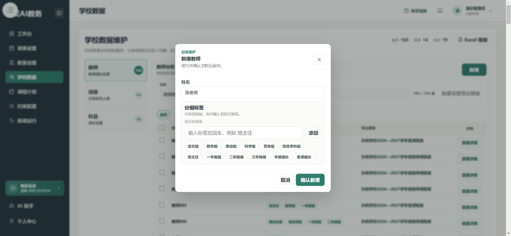
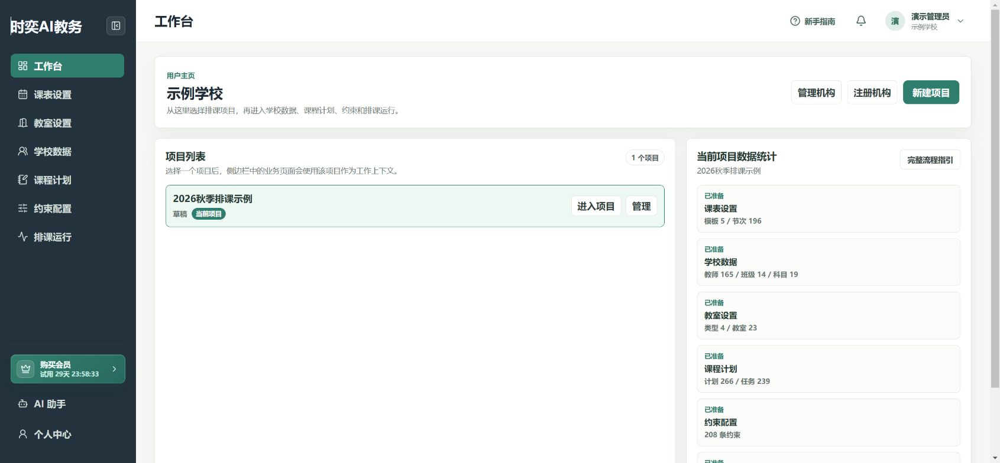
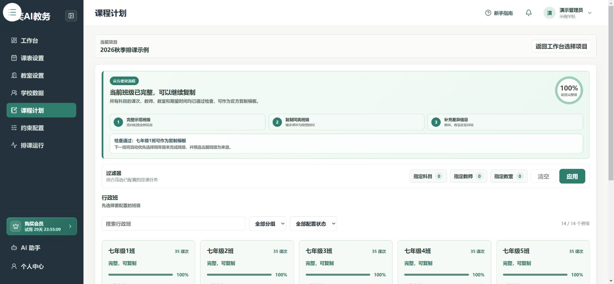
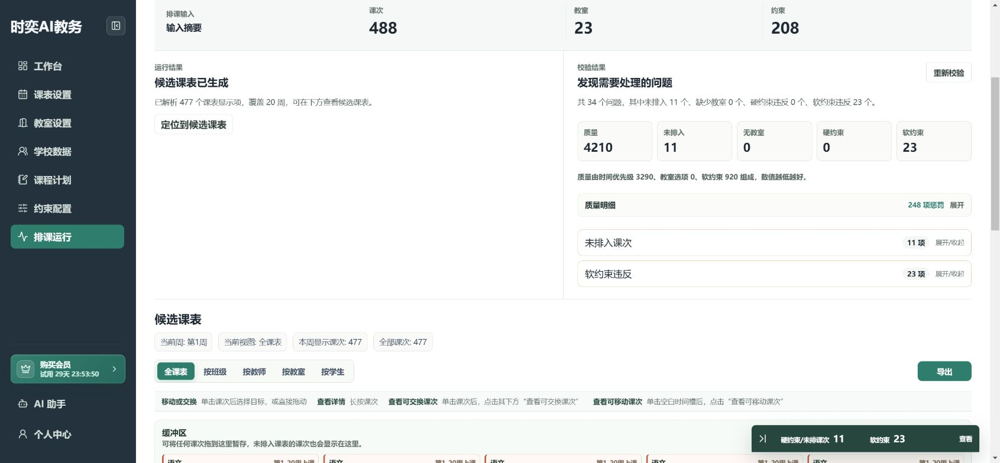

# 排课前准备

第一次使用，建议先做一个班级，再扩展到全校。

## 第1步：准备学校资料

- 作息表：每周上几天课，每节课几点开始、几点结束。
- 名单：教师、班级、科目和教室。
- 授课安排：每个班的每门课由谁教，每周几节。
- 特殊要求：哪些时间不能上课，哪些课需要连排等。

可以先下载[建议收集数据示例表](/建议收集数据示例表.xlsx)整理资料。它是收集参考表，不代表所有页面都能直接导入它。

## 第2步：选对项目

登录后进入 **工作台**，在项目列表中选择本次排课的项目，再点击 **进入项目**。

**机构就是学校，项目就是一次排课任务。** 例如“2026年秋季排课”可以作为一个项目。

## 第3步：按顺序完成配置

**课表设置 → 学校数据和教室 → 课程计划 → 约束配置 → 排课运行。**

先把一个班级的教师、教室和每节课可上课时间配完整，再复制相似班级，能少做很多重复操作。

## 第4步：排课后先检查，再导出

生成课表不代表所有问题都解决了。先检查 **未排入、无教室、硬约束**，再查看各班课表。

下面是有问题的示例，不能直接当作最终课表发给教师。

准备好了？开始[第一次排课：跟着做](./complete-workflow.md)。
